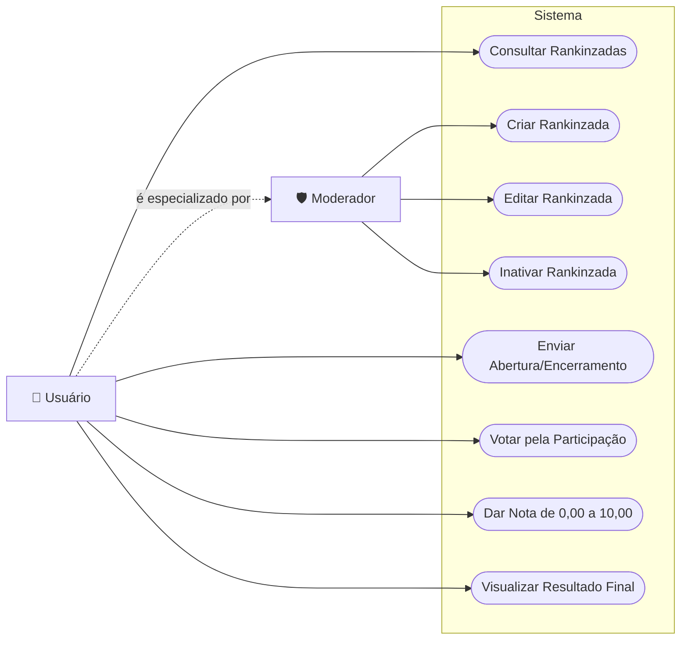

## Caso de Uso

## Endpoints

`POST /auth:` Autenticar usuário e retornar token JWT.

`POST /users:` Cadastrar um novo usuário.

`GET /users/me`: Retornar as informações do usuário autenticado.

`GET /rankinzadas`: Listar todas as rankinzadas.

`GET /rankinzadas/{id}`: Retornar os detalhes de uma rankinzada.

`POST /rankinzadas`: Criar uma nova rankinzada.

`PUT /rankinzadas/{id}`: Editar uma rankinzada.

`PATCH /rankinzadas/{id}/status`: Atualizar a fase da rankinzada.
- SUGGESTION
- PARTICIPATION
- VOTING
- FINISHED

`DELETE /rankinzadas/{id}`: Inativar uma rankinzada.

`POST /rankinzadas/{id}/songs`: Adicionar uma abertura/encerramento à rankinzada.

`GET /rankinzadas/{id}/songs`: Listar todas as aberturas e encerramentos da rankinzada.

`DELETE /rankinzadas/{id}/songs/{songId}`: Remover uma abertura/encerramento da rankinzada.

`POST /rankinzadas/{id}/participations`: Registrar os votos de participação (sim/não) para as aberturas/encerramentos.

`POST /rankinzadas/{id}/votes`: Registrar as notas (0,00 a 10,00) das aberturas/encerramentos.

`GET /rankinzadas/{id}/result`: Retornar o resultado final da rankinzada, ordenando as aberturas/encerramentos da maior para a menor nota média.
